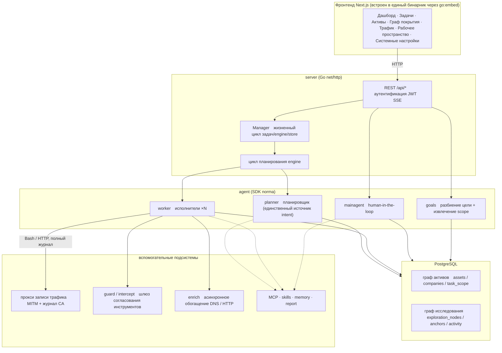
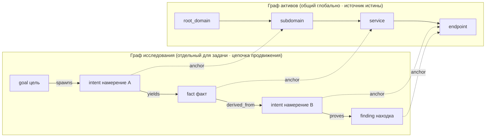
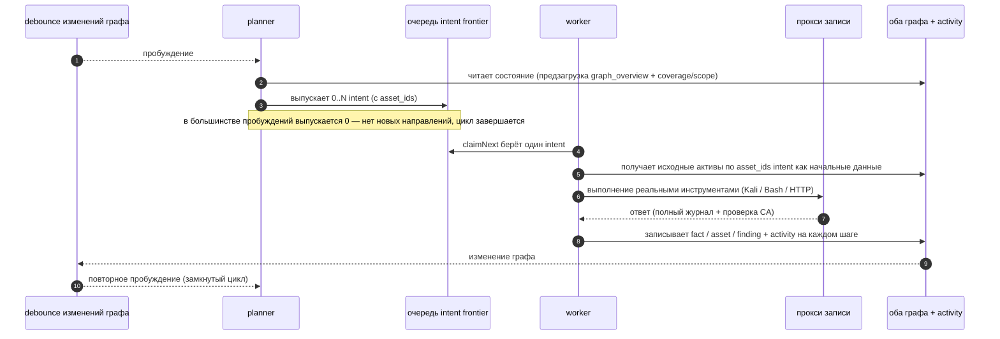
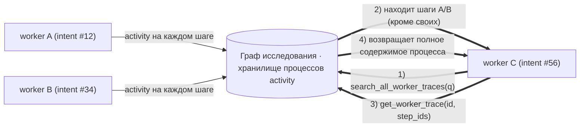
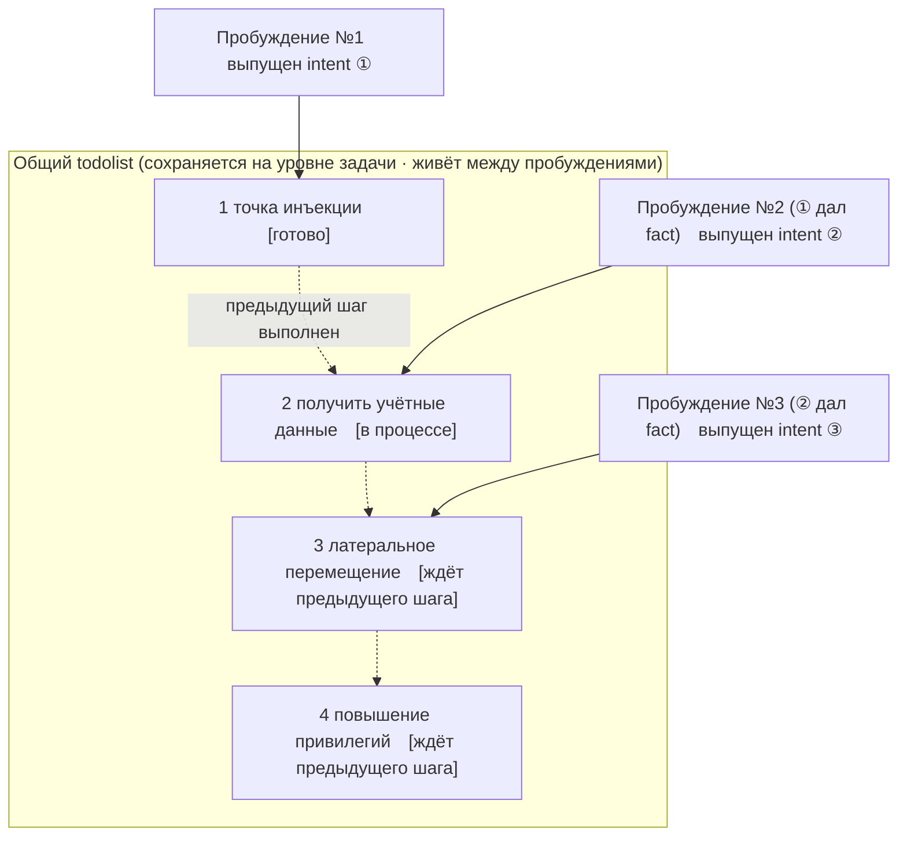

<div align="center">

# ARTEX

Автономная ИИ-система пентестинга (Go-бэкенд + Next.js-фронтенд)

🇷🇺 **Это форк оригинального проекта [Autumn-27/ARTEX](https://github.com/Autumn-27/ARTEX) с интерфейсом, переведённым на русский язык.** Весь пользовательский фронтенд, типы и комментарии клиентского API переведены; backend на Go частично остаётся на языке оригинала. Все возможности и архитектура оригинала сохранены — ниже описана установка именно этого форка.

📦 **У этого форка нет готового Docker-образа или страницы Releases, пока вы не настроите их сами** (например, запустив `.github/workflows/release.yml` на своём репозитории). До тех пор собирайте бинарник/образ из исходного кода — см. раздел «Установка» ниже.

</div>

---

## Скриншоты

> Полное взаимодействие см. в [онлайн-демо](https://artex-demo.vercel.app/).

| Дашборд (обзор / расход токенов / лента активности) | Список задач |
| :---: | :---: |
|  |  |

| Задача · процесс выполнения (сессии / вызовы инструментов) | Цепочка исследования |
| :---: | :---: |
|  |  |

| Находки | Активы |
| :---: | :---: |
|  |  |

| Граф покрытия активов (force-directed layout · подсветка протестированного · сворачивание/разворачивание узлов) |
| :---: |
|  |

| Запись трафика | Диалог с человеком в контуре |
| :---: | :---: |
|  |  |

| Управление агентами | Настройка LLM |
| :---: | :---: |
|  |  |

| Перехват и согласование | Логи бэкенда |
| :---: | :---: |
|  |  |


---

## Детали записи согласования

Глобальный раздел «Записи согласований», «Перехваты и согласования» внутри задачи, а также карточки согласования в диалоге поддерживают разворачивание для просмотра деталей. Структура отображения основана на
[компоненте деталей согласования AegisHook](https://github.com/RuoJi6/AegisHook/blob/main/web/src/components/CallDetail.vue), с использованием собственных компонентов и темы ARTEX:


## Синхронизация активов (ScopeSentry)

Поддерживается прямая синхронизация данных об активах из [ScopeSentry](https://github.com/Autumn-27/ScopeSentry) — без повторного сбора данных:

- На странице «**Синхронизация активов**» укажите адрес ScopeSentry и API-ключ, чтобы подключить источник данных;
- Выберите цели и типы активов для синхронизации (домены / поддомены / IP / порты / сайты / эндпоинты…) в разрезе **проекта** или **задачи**;
- Импортируйте одним нажатием и объедините по границам активов компании — данные сразу попадают в граф активов ARTEX для использования агентами при исследовании.

---

## Установка

> Требуется база данных **PostgreSQL**; для исследования нужно настроить **LLM** (`ANTHROPIC_API_KEY` или `OPENAI_API_KEY`, также можно настроить в UI).

### Способ 1: скрипт установки в один клик (рекомендуется)

```bash
git clone https://github.com/codermn15121981/ARTEX.git
cd ARTEX
./install.sh
```

Скрипт: проверит / автоматически установит Docker → предложит выбрать **① полностью в Docker** или **② локальную компиляцию и запуск**:

- **① Полностью в Docker**: введите пароль Postgres (можно нажать Enter для случайного) → автоматически создастся `.env` → скрипт **соберёт фронтенд и бинарник из исходного кода этого форка** (этот форк не публикует готовый образ) → `docker compose build && docker compose up -d`.
- **② Локальный запуск**: выберите БД (подключиться к существующей / поднять через Docker) → сгенерируется `config.json` → `go` соберёт единый бинарник со встроенным фронтендом → запуск.

После установки откройте **http://localhost:8787** (при первом входе откроется `/setup` для задания пароля администратора).

### Способ 2: Docker Compose (вручную)

```bash
git clone https://github.com/codermn15121981/ARTEX.git
cd ARTEX
cp .env.example .env          # заполните POSTGRES_PASSWORD, опционально ANTHROPIC_API_KEY
docker compose build          # соберёт образ из исходного кода этого форка (см. примечание ниже)
docker compose up -d          # запустит artex + postgres
# → http://localhost:8787
```

> Этот форк не публикует образ на Docker Hub — `docker-compose.yml` собирает его локально из `Dockerfile` этого репозитория. Если вы настроили собственную публикацию образа через `.github/workflows/release.yml` (в GitHub Container Registry, без дополнительных секретов), можно заменить `build:` в `docker-compose.yml` на `image: ghcr.io/<ваш-owner>/artex:<тег>` и пропустить `docker compose build`.

В образе уже есть часто используемые инструменты (ripgrep/curl/vim/npm/nmap…); `./skills` и `./data` сохраняются через bind-mount.

Для удалённого MCP в системных настройках можно выбрать `http` (Streamable HTTP) или `sse` (устаревший вариант SSE).
Старые SSE-сервисы обычно открывают поток событий через `GET /sse`, а затем принимают
JSON-RPC запросы через `/message?sessionId=...`, возвращённый сервисом; при настройке укажите
URL как `/sse`, а заголовок запроса в формате `Authorization=Bearer <token>`.

### Способ 3: скачать готовый бинарник (Releases)

> У этого форка Releases появятся только после того, как вы запустите workflow `.github/workflows/release.yml` в своём репозитории (запускается при push тега `v*`) — он не требует Docker Hub или других внешних секретов. До этого используйте способ 1, 2 или 4.

Скачайте zip-архив для своей платформы со страницы [Releases](https://github.com/codermn15121981/ARTEX/releases); после распаковки вы получите `artex` + `start.sh` (на Windows — `start.bat`) + `skills/` + `config.example.json`:

```bash
cp config.example.json config.json   # заполните подключение к database
./start.sh                           # → http://localhost:8787
```

> Запускайте через `start.sh` / `start.bat`, а не напрямую через `./artex`. Это скрипт-супервизор: после завершения процесса он по коду выхода решает, перезапускать ли программу, и именно через него работает [обновление в один клик](#способ-1-обновление-на-странице-в-один-клик-рекомендуется) на странице. Если запустить `./artex` напрямую, после обновления процесс не будет перезапущен.
> Для постоянной работы в фоне: `nohup ./start.sh >artex.log 2>&1 &`.

### Способ 4: сборка единого бинарника из исходного кода

```bash
# 1) статическая сборка фронтенда
cd web && npm ci && npm run build:static && cd ..
# 2) копируем во встраиваемую директорию
cp -r web/out server/webui/dist
# 3) сборка (фронтенд встраивается только с -tags embedui)
CGO_ENABLED=0 go build -tags embedui -o artex ./cmd/artex
./start.sh
```

### Способ 5: сборка кросс-платформенных релизных архивов

`build.sh` сначала собирает и встраивает фронтенд, затем с помощью Go linker убирает debug-информацию и упаковывает релиз в zip. В режиме Release по умолчанию создаются zip-архивы для Linux amd64/arm64, macOS amd64/arm64 и Windows amd64:

```bash
./build.sh --release
# результат: dist/artex-0.3.3-*.zip
```

Самораспаковывающиеся бинарники UPX могут быть несовместимы с некоторыми ядрами Linux, средами виртуализации или политиками безопасности, поэтому по умолчанию они отключены. Список целевых платформ можно задать через `ARTEX_TARGETS`; если вы уверены, что целевая среда совместима, можно явно передать `--upx`, чтобы дополнительно уменьшить размер бинарника:

```bash
ARTEX_TARGETS=linux/amd64,windows/amd64 ./build.sh --release
./build.sh --target linux/amd64 --upx
```

---

## Обновление

> Обновление заменяет только программу, данные не трогаются: том Postgres `pgdata`, `./data` (jwt.key / SQLite и т.д.) и `./skills` сохраняются. **Миграции базы данных выполнять вручную не нужно** — при каждом запуске `artex` идемпотентно повторно прогоняет `schema.sql` (включая `ADD COLUMN` / `CREATE INDEX IF NOT EXISTS`), то есть «перезапуск = миграция». Перед обновлением всё же рекомендуется сделать резервную копию `./data` и базы данных.

### Способ 1: обновление на странице в один клик (рекомендуется)

На странице **Системные настройки** (в боковом меню «Системные настройки» → `/system/settings`), в карточке **Версия и обновления**, можно прямо проверить и установить новую версию без входа на сервер.

> Эта функция проверяет Releases **этого форка** (`codermn15121981/ARTEX`), а не оригинального проекта — так обновление в один клик никогда не подменит переведённую сборку непереведённым бинарником автора оригинала. Пока вы не настроили собственные Releases (см. примечание в разделе «Установка»), проверка будет сообщать, что релизов пока нет, — это ожидаемо.

После нажатия «Обновить»: скачивается релизный пакет для текущей платформы → сверяется с `SHA256SUMS` релиза → новый бинарник проходит smoke-тест через `-h` → сохраняется во временный файл `artex.new` → программа завершается, и `start.sh` / `start.bat` перезапускает её и завершает замену. Страница автоматически дождётся выхода новой версии и обновится.

- **Сбой не оставит после себя неработающую программу**: если проверка или smoke-тест не пройдены, временный файл отбрасывается и продолжает работать текущая версия; если новая версия после замены не запускается 3 раза подряд, происходит автоматический откат на `artex.old` (неудачная версия сохраняется как `artex.failed` для разбора).
- **Можно откатиться в любой момент**: предыдущая версия сохраняется как `artex.old`, на карточке есть кнопка «Откатиться к предыдущей версии». Обратите внимание, что структура базы данных при этом не откатывается.
- **Обновление прерывает выполняющиеся задачи** — обновление означает перезапуск, выполняйте его в период простоя.
- **Для dev-сборок обновление недоступно**: если версия — `dev` или `git describe` с суффиксом, обновление отключается, чтобы релизная версия не затирала локально собранный для отладки бинарник.
- **В Docker обновляется только программа, но не образ**: инструменты в образе (playwright / nmap и т.д.) при этом не обновляются, а после пересборки контейнера `docker compose up -d` версия откатится к той, что встроена в образ. Чтобы обновить вместе с образом, используйте `./update.sh` (способ 2 ниже) или пересоберите образ вручную.
- Если для доступа к GitHub нужен прокси, настройте **глобальный прокси** на той же странице — обновление будет использовать его. Загрузка обновлений идёт только с доменов GitHub и только по HTTPS.

### Способ 2: скрипт обновления в один клик

```bash
cd ARTEX
./update.sh
```

Скрипт сначала опционально выполнит `git pull`, чтобы получить последний код, затем предложит выбрать **① обновление через Docker** или **② локальную пересборку** (соответствует `install.sh`):

- **① Docker**: скрипт пересоберёт фронтенд и бинарник из исходного кода (этот форк не публикует готовый образ) → `docker compose build artex` → `docker compose up -d artex` (перезапуск с новым образом автоматически выполняет миграцию).
- **② Локально**: пересобирается статика фронтенда → пересобирается `./artex` (после завершения перезапустите процесс, чтобы изменения вступили в силу).

### Способ 3: Docker Compose (вручную)

```bash
cd ARTEX
git pull                       # получить обновления compose / скриптов / исходного кода
docker compose build artex     # пересобрать образ из исходного кода этого форка
docker compose up -d artex     # перезапуск с новым образом → автоматическая миграция схемы
docker image prune -f          # очистка старых образов (опционально)
```

> Если вы публикуете собственный образ через `ghcr.io` (см. примечание в разделе «Установка»), замените `docker compose build artex` на `docker compose pull artex`, указав нужный тег через `ARTEX_TAG` в `.env`.

### Способ 4: готовый бинарник (Releases)

> Доступно только если у этого форка настроены свои Releases (см. примечание в разделе «Установка» выше).

Скачайте zip с новой версией со страницы [Releases](https://github.com/codermn15121981/ARTEX/releases), остановите старый процесс, замените `artex` и `skills/` (оставив ваш `config.json` и `data/`), и перезапустите:

```bash
cp -r <распакованная_папка>/skills ./ && cp <распакованная_папка>/artex ./
./start.sh
```

### Способ 5: сборка из исходного кода

```bash
git pull
cd web && npm ci && npm run build:static && cd ..
cp -r web/out server/webui/dist
CGO_ENABLED=0 go build -tags embedui -o artex ./cmd/artex
# перезапустите ./start.sh
```

---

## Конфигурация

**База данных** (`config.json`, либо переопределение через переменную окружения `ARTEX_PG_DSN`):

```json
{
  "database": {
    "host": "127.0.0.1", "port": 5432,
    "user": "artex", "password": "yourpass",
    "dbname": "artex", "sslmode": "disable"
  }
}
```

**LLM**: `export ANTHROPIC_API_KEY=sk-...` (или `OPENAI_API_KEY`), также можно указать на странице «Настройка LLM» в UI.
Опционально: `ARTEX_LLM_PROVIDER` / `ARTEX_LLM_MODEL` / `ARTEX_LLM_BASE_URL` / `ARTEX_LLM_PROXY`.

**Параллелизм**: количество worker-агентов на задачу настраивается в «Системных настройках» (по умолчанию 3).

**Часто используемые параметры**: `./start.sh -addr :8787 -proxy :8788` (`-addr` — фронтенд+API, `-proxy` — прокси записи трафика). Скрипт запуска передаёт параметры в `artex` без изменений.

### Развёртывание за reverse-proxy (HTTPS / открыт только 443)

Фронтенд и API/SSE отдаются с одного порта бэкенда (по умолчанию `:8787`), лента активности в реальном времени по умолчанию идёт через **тот же источник (same-origin)**, поэтому **настраивать `NEXT_PUBLIC_SSE_BASE` не нужно** — достаточно открыть в публичной сети только 443, а 8787 оставить во внутренней сети.

SSE — это долгоживущее соединение с постоянной отправкой событий, поэтому в reverse-proxy **обязательно нужно отключить буферизацию**, иначе браузер подключится, но не будет получать события (это выглядит как бесконечный спиннер в ленте активности). Пример для Nginx:

```nginx
server {
    listen 443 ssl;
    server_name your.domain.com;
    # ssl_certificate / ssl_certificate_key ...

    location / {
        proxy_pass http://127.0.0.1:8787;
        proxy_set_header Host $host;
        proxy_set_header X-Forwarded-Proto $scheme;

        # Критично для SSE: отключить буферизацию, длинный таймаут, HTTP/1.1
        proxy_buffering off;
        proxy_cache off;
        proxy_read_timeout 3600s;
        proxy_http_version 1.1;
        proxy_set_header Connection "";
    }
}
```

> Настраивать `NEXT_PUBLIC_SSE_BASE` на этапе **сборки** нужно только если SSE должен идти с другого источника, чем страница (например, с отдельного поддомена) — эта переменная фиксируется в статической сборке во время `next build`, и задавать её при запуске контейнера бесполезно.

---


## Разработка

### Ручной повторный тест уязвимостей (retest)

На вкладке «Повторный тест» в деталях задачи можно постранично выбирать уязвимости этой задачи, смотреть выводы и доказательства прошлых проверок и вручную запускать повторный тест. После запуска текущая вкладка остаётся открытой, показывается значок загрузки и статус «Повторный тест»; после подтверждения исправления статус уязвимости обновляется синхронно.

Нажмите «Повторный тест» в области действий строки списка уязвимостей, либо «Запустить повторный тест» в разделе «Повторный тест уязвимости» в деталях уязвимости, укажите (опционально) версию с исправлением, условия или ограничения теста — система создаст отдельную сессию агента повторного теста, текущая страница останется открытой. Этот вход доступен в плоском списке, при группировке по задачам и в представлении по активам; во время выполнения повторного теста показывается значок загрузки и статус «Повторный тест», чтобы посмотреть детали — перейдите в соответствующую сессию, после завершения кнопка вернётся в состояние «Повторный тест». Повторный тест не требует перезапуска исходной задачи сканирования; вывод может быть «Воспроизводится снова», «Исправлено» или «Невозможно подтвердить» — вывод, доказательства и ссылка на сессию каждой проверки сохраняются в деталях уязвимости.

При первом запуске новой версии бэкенда создаётся редактируемый агент «Повторный тест уязвимости» (`retester`), для которого в разделе управления агентами можно настроить промпт, LLM, бюджет на выполнение и инструменты. По умолчанию используется привязанный к нему LLM, если он не задан — используется глобальная активная конфигурация. Когда сессия повторного теста успешно завершается с выводом «Исправлено», система автоматически меняет статус обработки уязвимости на «Исправлено»; при выполнении, сбое, остановке или другом выводе статус остаётся прежним. Исходные доказательства и отчёты сохраняются всегда. Статус «Исправлено» также можно выбрать вручную в выпадающем меню статуса. Если повторный тест этой же уязвимости уже выполняется, используется существующая сессия; после остановки, сбоя или перезапуска сервиса можно запустить заново.

В этой версии история просматривается через детали уязвимости и сессии; она пока не включается в экспорт отчёта об уязвимостях или архив задачи и не привязывается автоматически к пакету трафика. Демо-режим создаёт только явно помеченные как имитация записи и не обращается к реальным целям.

### Локальный запуск и тестирование

```bash
./dev.sh    # бэкенд(:8787) + прокси трафика(:8788) + фронтенд next dev(:5173) → http://localhost:5173
```

- Бэкенд: `go run ./cmd/artex` (без `-tags embedui` фронтенд не встраивается)
- Фронтенд: `cd web && npm run dev` (`/api` проксируется на бэкенд, с hot reload)
- Тесты: `go test ./...`
- Предпросмотр с mock-данными (без бэкенда): `cd web && NEXT_PUBLIC_MOCK=1 npm run dev`

---

## Техническая архитектура системы

ARTEX — это **автономная система пентестинга на основе множества LLM-агентов**: единый бэкенд на Go (со встроенным фронтендом на Next.js) + PostgreSQL, возможности агентов предоставляет SDK [`norma`](https://github.com/Autumn-27/norma) (`agentcore` / `tool` / `permission` / `harness` / `memory` / `transcript`). В основе — **архитектура двух графов** и два механизма автономности вокруг неё: **обмен информацией на уровне процесса между worker'ами** и **общий todolist планировщика на несколько итераций для устойчивой цепочки атаки**.

### Общая многослойная структура



| Слой | Ответственность |
| --- | --- |
| **Фронтенд** | Статический экспорт Next.js, встроен в единый бинарник через `go:embed`; визуализация задач/активов/цепочки исследования/графа покрытия, диалог с человеком в контуре |
| **server** | Роутинг на `net/http` + JWT-аутентификация + SSE; `Manager` управляет жизненным циклом задач, engine и DB store |
| **engine** | Один `plannerLoop` на задачу + N worker-горутин; получение intent, таймауты/пауза/drain |
| **agent** | goals / planner / worker / mainagent, `ToolSet` раскрывает оба графа как инструменты LLM |
| **db** | Хранение обоих графов в Postgres (pgx); схема идемпотентно применяется при каждом запуске через `go:embed` |
| **Вспомогательные** | MITM-прокси с записью, шлюз согласования, асинхронное обогащение, MCP/навыки/память/отчёты |

### Архитектура двух графов: граф исследования + граф активов

Система разделяет «**в чём состоит цель**» и «**насколько глубоко протестировано**» на два независимых, но связанных через якоря (anchors) графа:

- **Граф активов (Asset Graph, общий глобально)**: единый источник истины об активах, общий для всех задач. Узлы — `root_domain / subdomain / ip / service / app / endpoint`, привязанные к компании; родительско-дочерние связи домен→поддомен→сервис→эндпоинт и ключи дедупликации полностью вычисляются программой, агент передаёт только исходную информацию.
- **Граф исследования (Exploration Graph, отдельный для каждой задачи)**: процесс «размышления и продвижения» в рамках одной задачи. Узлы — `goal (цель) / intent (намерение) / fact (факт) / finding (находка) / hint (подсказка)`, связанные рёбрами `spawns / derived_from / yields / proves` в **цепочку происхождения (lineage)**, которая отвечает на вопрос «из каких фактов выросло это направление и что оно дало».
- **Графы связаны через якоря**: `exploration_anchors(node_id, asset_id)` привязывает intent/fact/finding к конкретным активам — так можно и посмотреть по «направлению исследования», какие активы оно затрагивает, и, наоборот, по «активу» узнать, какими intent он был протестирован в этой задаче и какие факты получены. На этом же построены **покрытие тестированием активов** и **граф покрытия активов** (активы в рамках scope + подсветка протестированных).



> Разделение ролей: **planner** читает состояние графа исследования, оценивает цель и выпускает **intent** во frontier только когда есть непокрытое новое направление; **worker** берёт **одно намерение**, выполняет его реальными инструментами и останавливается сразу после записи новых активов/фактов/находок в оба графа. Граф активов — это общие факты, граф исследования — цепочка продвижения конкретной задачи.

### Жизненный цикл engine и intent (замкнутый цикл одного исследования)

Engine — это **событийно-управляемый** замкнутый цикл: при любом изменении графа просыпается planner, planner выпускает intent, worker берёт его, выполняет и записывает результат, запись результата снова запускает следующий виток — и так до тех пор, пока цель не будет доказана (`prove_goal`).



### Обмен информацией на уровне процесса между worker'ами

В ходе глубокого исследования многие ценные наблюдения (конкретная ошибка, фрагмент ответа, скрытый параметр) появляются в **процессе выполнения** одного worker'а, но не всегда оформляются в виде официального fact. Чтобы не дублировать работу и дать worker'ам в цепочке возможность опираться на наработки друг друга, у worker есть способность **искать по процессам других work**:

- `search_all_worker_traces(q)`: поиск по ключевому слову в **процессе выполнения других work этой задачи** (шаги своего собственного intent автоматически исключаются), найденные результаты содержат `intent_id`;
- `list_worker_traces` / `get_worker_trace(intent_id, step_ids=[…])`: сначала посмотреть, какие work уже выполнялись, затем получить полное содержимое конкретных шагов нужного work для детального обмена.

Так последующие worker'ы могут повторно использовать наблюдения из процессов других, даже если в графе исследования ещё нет соответствующего fact — **информация передаётся между worker'ами на уровне «процесса выполнения»**, при этом границы не меняются (каждый worker всё равно выполняет только свой собственный intent).



### Общий todolist планировщика на несколько итераций → устойчивая цепочка атаки

Реальная цепочка атаки — это часто **многошаговая последовательность с зависимостями** (например: обнаружение точки инъекции → получение учётных данных → латеральное перемещение → повышение привилегий), и если выпустить всё это параллельно за один раз, получится хаос. Поэтому planner хранит **todolist, сохраняемый на уровне задачи и общий между пробуждениями**:

- planner событийно-управляемый — просыпается при любом изменении графа, но **каждое пробуждение — это новая сессия**; общий todolist позволяет **один раз зафиксировать** последовательную цепочку эксплуатации, а затем в последующих итерациях **выпускать intent постепенно, по зависимостям**, вместо того чтобы разворачивать всю цепочку целиком за один заход;
- на каждой итерации intent выпускается только для следующего шага, у которого «предыдущие шаги завершены и нужные ему fact уже существуют», а по мере продвижения список обновляется (шаги, для которых fact уже есть, отмечаются выполненными).



Таким образом цепочка атаки в условиях «событийного управления + сессий без состояния» всё равно продвигается **стабильно, без повторов и без нарушения порядка** — это ключевая причина, по которой ARTEX способен автономно пройти многошаговую цепочку эксплуатации.

---

## Сообщество

Отсканируйте QR-код, чтобы подписаться на аккаунт WeChat **SecSentry**, и напишите личное сообщение в его администрацию, чтобы попасть в группу общения.

<div align="center">


</div>

---
## Ссылки

https://github.com/oritera/Cairn


## Лицензия и отказ от ответственности

### Лицензия с открытым исходным кодом

Этот проект распространяется по лицензии **GNU Affero General Public License v3.0 (AGPL-3.0)**, полные условия см. в файле [LICENSE](LICENSE) в корне репозитория.

Это означает, что любой может свободно использовать, изменять и распространять проект, но **производные работы также обязаны быть открытыми по AGPL-3.0**; в частности, **если вы изменили проект и предоставляете его пользователям через сеть (например, развернув как онлайн-сервис), вы также обязаны раскрыть этим пользователям полный исходный код соответствующей версии**.

> ⚠️ **Важно**: сама лицензия с открытым исходным кодом не ограничивает цели использования программы. Приведённые ниже «Ограничения использования» и «Отказ от ответственности» — это дополнительные условия и официальное заявление автора для пользователей, их обязательно необходимо соблюдать.

**ARTEX предназначен только для личного обучения, изучения кода и локальной проверки технических принципов; его запрещено использовать для проведения реального тестирования любых онлайн-систем или сайтов.**

### Разрешённые сферы использования

- Разрешено только **чтение, изучение и исследование исходного кода этого проекта**, а также проверка технических принципов в **локальной изолированной среде**;
- Подходит для личного обучения, академических исследований, код-ревью и других неатакующих целей.

### Запрещённые действия

- **Категорически запрещено использовать этот инструмент для сканирования, зондирования, эксплуатации или атак на любые сайты, онлайн-сервисы или системы, подключённые к сети** (независимо от наличия авторизации и от того, являются ли они вашими собственными активами);
- Запрещено использовать этот инструмент для какого-либо реального пентестинга, состязаний «атака-защита» или в production-среде;
- Запрещено использовать этот инструмент для незаконного проникновения, кражи данных, вымогательства, отказа в обслуживании или любой другой деструктивной, преступной деятельности;
- Запрещено использовать этот инструмент для действий, нарушающих законы и нормативные акты страны/региона пользователя.

### Ответственность за соблюдение законодательства

Пользователь обязан самостоятельно соблюдать все законы и нормативные акты своей страны/региона в области кибербезопасности, защиты данных и компьютерных преступлений (в частности, для материкового Китая это включает, но не ограничивается, «Законом о кибербезопасности», «Законом о безопасности данных», «Законом о защите личной информации» и связанными судебными разъяснениями). **Любая юридическая ответственность и последствия, возникшие в результате использования этого инструмента, полностью лежат на пользователе.**

### Отказ от ответственности

Этот проект предоставляется «как есть» (AS IS), без каких-либо явных или подразумеваемых гарантий. Автор и контрибьюторы не несут ответственности за любой прямой или косвенный ущерб, потерю данных, повреждение систем или юридические споры, возникшие в результате использования этого инструмента (независимо от того, использовался он надлежащим образом или нет). **Скачивая, устанавливая или используя этот проект, вы подтверждаете, что прочитали, поняли и согласны со всеми перечисленными выше условиями.**
